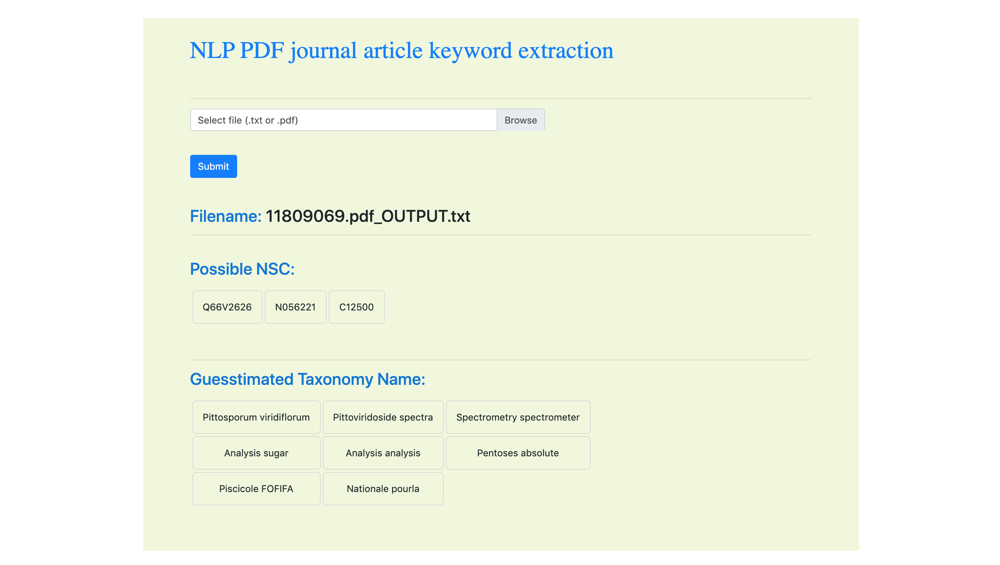

# NLP web-app
## Parse PDF journal articles and extract keywords

This small flask application demonstrates use of NLTK to extract keywords (such as unique NSC identifiers and taxonomy related words) from PDF journal articles and render on the web-page for quick and easy interpretation as well as in an effort to automate updating an EndNote X9 reference library. This newer version of the app uses an `Embedding` layer for a neural network. The framework used was `Tensorflow`.

#### Installation
There are two version of the `Dockerfile`; one for testing locally and a second for deploying on the server. Choose the local version for a local install. Simply enter in the terminal: `docker build -t app-name 'path/to/app'`.

After installing all dependencies and building from `Dockerfile`, run the app by entering its folder and typing:

`docker run -d app-name`

There are two tabs that refer to the method of parsing. One is through an email link provided in a weekly email blast, and another by simply uploading the `.pdf` or `.txt` file. The former case uses PubMed's OpenAccess API to download the `.pdf` file programmatically, whereas the latter method prompts users to upload a local file. The file could be a `.txt` or `.pdf` file. The output in both cases will return two small `HTML` tables:
1. Guesstimated NSC numbers that relate to the natural product extract (compound)
2. Guesstimated taxonomy names that were found in the corpus

Screenshot of the web-app:

